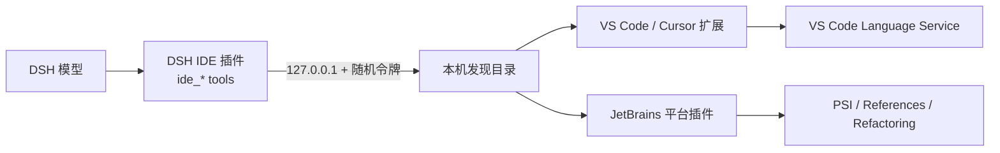

# DSH IDE Bridge

这是一个可安装的 DeepSeek Harness 组合插件，让模型直接读取和操控正在运行的 IDE。当前支持：

- Visual Studio Code、Cursor 及其他 VS Code 兼容编辑器
- IntelliJ IDEA、PyCharm、WebStorm、GoLand、CLion、DataGrip 等 IntelliJ Platform IDE

能力设计参考了 [Serena](https://github.com/oraios/serena) 的符号优先工作流，但不要求另外启动 MCP 服务。DSH 直接获得 `ide_*` 工具，IDE 端负责调用自己的语言服务、PSI、诊断和重构 API。



## 已提供的工具

| 工具 | 用途 |
| --- | --- |
| `ide_status` | 检查连接、IDE、工作区和当前编辑器 |
| `ide_context` | 获取活动文件、光标、选区、选中文本和附近代码 |
| `ide_open` | 在 IDE 中打开文件并跳转到指定位置 |
| `ide_diagnostics` | 获取 IDE 的实时错误、警告和提示 |
| `ide_symbols` | 文件符号、工作区符号、定义、引用、实现和 hover |
| `ide_edit` | 精确文本替换，或按符号替换/前插/后插 |
| `ide_rename_symbol` | 使用 IDE 重构引擎跨项目重命名 |
| `ide_command` | 执行白名单中的保存、格式化、导航或 UI 命令 |

JetBrains 版当前不暴露 hover 渲染，调用时会明确返回 `IDE_OPERATION_UNSUPPORTED`；其他核心读写能力使用 PSI 和重构 API。`ide_command` 在 JetBrains 版首期支持保存当前文件和保存全部文件。

## 0.3.0 自动调度

插件在每轮模型请求中注入一条紧凑的动态上下文，列出当前连接的 IDE 与工作区，但不会暴露端口、令牌或其他认证数据。系统指导明确要求模型在下列场景优先调用 `ide_*`：当前文件、活动编辑器、选区、光标、实时诊断、定义/引用/实现、IDE 重构，以及显式 IDE 操作。批量文本搜索仍使用 `read`、`grep` 和 `glob`。

项目同时交付 `dsh-ide-bridge` Skill，用于显式调度：

```powershell
npm run install:skill
```

安装后可以直接要求模型“使用 dsh-ide-bridge skill 检查当前文件”。Skill 位于 `skills/dsh-ide-bridge/SKILL.md`，安装脚本只创建目录链接；如果目标位置已有非链接文件，脚本会拒绝覆盖。将 `autoContext: false` 写入插件配置可以关闭自动上下文，但不影响 Skill 和工具。

## 0.3.0 Token 优化

- 工具面向模型的结果改为紧凑文本，规范 JSON 仍保留在工具值中。
- `ide_symbols` 默认只保留类、函数、方法、接口、枚举、顶层变量等高价值符号；0.3.0 进一步过滤函数内部局部变量和匿名函数表达式。传入 `include_low_value: true` 可恢复完整 PSI/LSP 列表。
- 符号默认上限从 200 降到 50，文档符号默认只取顶层。
- `ide_diagnostics` 默认只返回 error 和 warning，上限从 200 降到 100，并过滤没有消息的诊断。
- `ide_context` 的默认附近源码从 4000 字符降到 2000 字符。
- 编辑后的诊断只返回 warning/error，默认渲染上限从 24000 降到 12000 字符。

这些默认值可以通过工具参数显式放宽，不会删除 IDE 端能力。实测同一份 JetBrains 符号结果的规范 JSON 为 16125 字符，0.3.0 默认模型输出为 914 字符，缩短约 94%。实际比例会随语言和符号结构变化。

## 安装

### 1. 安装 DSH 组合插件

在本目录执行：

```powershell
dsh plugin --profile web add .
```

如果使用其他 profile，把 `web` 换成相应名称。验证配置层：

```powershell
dsh --profile web --dump-config
```

输出中应出现 `dsh-ide-bridge`。重启该 profile 对应的 DSH 进程。

开发时也可以直接使用覆盖层，不安装包：

```yaml
- insert:
    - id: dsh-ide-bridge
      name: 'C:/absolute/path/to/DSH-IDE-Bridge/index.js'
```

### 2A. VS Code / Cursor

从 `dist/` 安装构建好的 `dsh-ide-bridge-vscode-0.3.0.vsix`：

```powershell
code --install-extension .\dist\dsh-ide-bridge-vscode-0.3.0.vsix
# 或
cursor --install-extension .\dist\dsh-ide-bridge-vscode-0.3.0.vsix
```

安装后重载 IDE 窗口。命令面板提供：

- `DSH IDE Bridge: Show Status`
- `DSH IDE Bridge: Restart Bridge`

### 2B. JetBrains 系列

在 IDE 中打开 `Settings / Plugins`，点击齿轮菜单，选择 `Install Plugin from Disk...`，然后选择 `dist/` 中的 `dsh-ide-bridge-jetbrains-0.3.0.zip`。安装后重启 IDE。

### 3. 验证

保持项目同时在 DSH 会话和 IDE 中打开，然后向模型发送：

```text
调用 ide_status，告诉我当前 IDE 和活动文件。
```

多开 IDE 窗口时，DSH 会按本次会话的 `cwd` 和工具请求中的文件路径选择工作区；选中后，该 DSH 会话会稳定绑定同一个 IDE 进程。不同 DSH 会话可以同时绑定不同窗口。如果多个窗口无法唯一匹配，工具会返回 `IDE_INSTANCE_AMBIGUOUS`，要求使用绝对路径或配置 `workspaceRoot`，不会按最近心跳随机选择。

## 安全模型

- IDE 桥只监听 `127.0.0.1`，不会暴露到局域网。
- 每次 IDE 启动都会生成新的 256 位随机令牌。
- 发现文件存放在系统临时目录的 `dsh-ide-bridge/` 下；DSH 从中读取端口、令牌和工作区信息。
- 默认拒绝打开或编辑工作区外的文件。
- 文本替换默认要求 `old_text` 只出现一次；多处匹配必须显式传入 `replace_all: true`。
- IDE 命令需要命中白名单；VS Code 可通过 `dshIdeBridge.allowedCommands` 设置扩展。
- 符号重命名交给 IDE 的重构引擎执行，不做全局字符串替换。

VS Code 如需允许工作区外文件，可设置 `dshIdeBridge.allowOutsideWorkspace`。JetBrains 对应的进程环境变量是 `DSH_IDE_ALLOW_OUTSIDE_WORKSPACE=true`。

## 高级配置

DSH 插件默认自动发现 IDE，一般不需要配置。可在自己的 profile patch 中覆盖：

```yaml
- id: dsh-ide-bridge
  name: dsh-ide-bridge
  config:
    timeoutMs: 30000
    maxResponseBytes: 4194304
    maxRenderChars: 12000
    autoContext: true
    # discoveryDir: 'D:/custom/discovery'
    # workspaceRoot: 'D:/project'
    # host: 127.0.0.1
    # port: 17373
    # token: 'only-for-fixed-port-mode'
```

可用环境变量：

- `DSH_IDE_DISCOVERY_DIR`：DSH 与 JetBrains 共用的发现目录
- `DSH_IDE_DISCOVERY_FILE`：让 DSH 固定连接某一个发现文件
- `DSH_IDE_TOKEN`：显式端口模式下的令牌
- `DSH_IDE_PORT`：JetBrains 端固定监听端口；默认随机端口

## 从源码验证与打包

```powershell
npm test
npm run check
npm pack
```

VS Code 扩展通过 `@vscode/vsce` 打包。JetBrains 扩展使用 Gradle IntelliJ Platform Plugin 的 `buildPlugin` 任务，产物位于 `jetbrains-extension/build/distributions/`。

## 与 Serena / MCP 的关系

这个插件采用 Serena 的“先符号理解，再精确编辑，再看诊断”工作流，但数据来自用户正在操作的 IDE，因此能同步活动文件、选区和窗口动作。Serena 更适合独立的语言服务器与项目记忆场景；两者可以同时启用。若只需要 Serena，DSH 自带 MCP client 也可以直接启动 Serena MCP，无需经过本插件。
